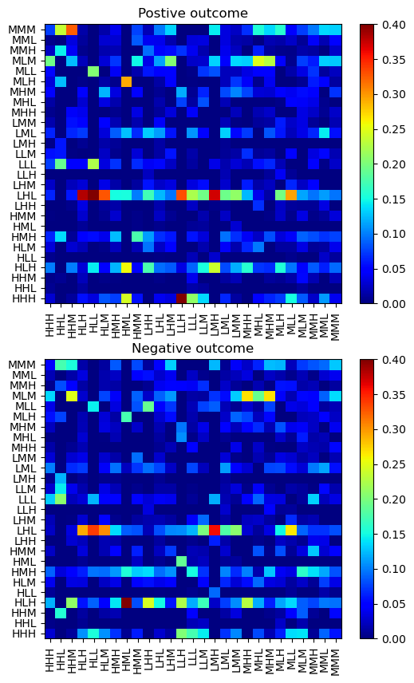

# SARS-CoV-2 variant binding affinity prediction

**Author:** `Chen Chen` 
**Date:** `2023-05-03` 
**Tags:** `Python`, `Machine Learning`, `Bioinformatics`, `Convolutional Neural Network` 

## Introduction

The cellular entry of severe acute respiratory syndrome coronavirus 2 (SARS-CoV-2) involves the association of its receptor binding domain (RBD) with human angiotensin-converting enzyme 2 (hACE2) as the first crucial step. The binding affinity between RBD and ACE2 proteins contributes to infectivity and transmissibility, and amino acid (AA) changes or mutations on either protein can alter the resulting variant's binding affinity to different degrees. To predict the binding affinity of these variants, a machine-learning (ML) model was developed based on the experiment data available and applied to both human and livestock animals.

Specifically, the following tasks are covered in the present project:

- A local MySQL database Was constructed by pulling data from [Yahoo Finance](https://finance.yahoo.com/).
- Some basic analyses were performed to check if some of the intuitions about the stocks are correct.
- The Markov Chain model was built to understand some basic fluctuation patterns.

Note that this is a truncated version of the study, to get more technical details, please refer to the original publication [A CNN model for predicting binding affinity changes between SARS-CoV-2 spike RBD variants and ACE2 homologues](https://www.biorxiv.org/content/10.1101/2022.03.22.485413v1).

## Data preparation
Retrieving online stock data can be easily achieved by using Google Sheets or Excel to pull data from Google Finance or Yahoo Finance. This is convenient until a large amount of data is needed to do some more complex analyses. Querying a local database considerably simplifies the process of data preparation and accelerates the analysis.

The MySQL database is constructed following the article [Securities Master Database with MySQL and Python](https://www.quantstart.com/articles/Securities-Master-Database-with-MySQL-and-Python/). A list of S&P500 companies together with a few index and sector exchange-traded funds (ETFs) was monitored and the time period spans from 2013 to 2023.
## Exploratory analysis

### Stock price changes on different weekdays
A while ago, some friends mentioned to me that there seems to be a trend that the stock prices usually increase on Fridays and decline on Mondays, and others might have the opposite impression of that. The difference between the close_price and the open_price of some ETFs such as [`SPY`](https://finance.yahoo.com/quote/SPY?p=SPY&.tsrc=fin-srch) can be used to check if this trend exists.

	 
	<b>Figure 1. </b>
		Stock price change (top) and density distribution (bottom) on Mondays and Fridays for SPY.
	

However, from the results shown above, it is apparent that there are no consistent patterns for the price change on Mondays and Fridays, showing a similar mean price change of 0.02%. 

	 
	<b>Figure 2. </b>
		Statistics of stock price change on different weekdays for SPY.
	

By plotting statistics of all five days on the above box plot and comparing all the data to the zero-percent-change horizontal baseline (blue dashed line), it is clear that for `SPY`, there is no specific price change pattern on any weekday. Note that, this might not be universal and represents only a general market behavior.

### Markov chain model (MCM)
*"A Markov chain or Markov process is a stochastic model describing a sequence of possible events in which the probability of each event depends only on the state attained in the previous event." -- Wikipedia*

The implementation of MCM to the stock prices is inspired by the tutorial [Predict Stock-Market Behavior with Markov Chains and Python](https://www.viralml.com/static/code/Predict-Stock-Market-With-Markov-Chains-and-Python.html). Essentially, the objective of the analysis is to predict the price change depending on the historical patterns. For example, if a stock's price has been going up for three days by 2%, how likely it will increase on the fourth day? Apparently, a definite answer probably does not exist but knowing how much this method can do can still be beneficial.

MCM describes the probability of transition from one state to another, where the state is coarsely defined by a three-letter string corresponding to the change of the close price, volume, and daily percentage as compared to the previous day. Possible values for the gaps are 'L', 'M', and 'H', referring to low, medium, and high, respectively. For example, a state of 'MLH' means that, compared to the previous day, the change of close price is medium, the change of volume is low, and the change of daily percentage is high.

	 
	<b>Figure 3. </b>
		Markov transition grids for state sequence with positive (top) and negative (bottom) outcomes for SPY. Color represents the probability of each x -> y pair.
	

With these defined states, Markov transition grids can be constructed as shown above. A sequence is formed by connecting consecutive states (continuous trading days) and there is an average price/volume increase/decrease corresponding to a positive/negative outcome. Specifically, for either case, a Markov transition grid is plotted, and most of the transitions are of low and equal possibility (exactly equal probability should be 1/27 = 0.037). However, a few hot spots can be also observed, indicating a strong correlation between the two different states. More care is needed to identify the properties of these state couples, which can be helpful in predicting certain trading behaviors.

## Conclusion
In this project, we've built a local MySQL database and retrieved data from Yahoo Finance for 500+ stocks. The simple analyses performed on `SPY` revealed that there doesn't seem to be any general price change pattern on different weekdays. The Markov chain model was built to further check the correlation of different stock states, which can be applied to screen other stock candidates to identify hidden patterns. 
