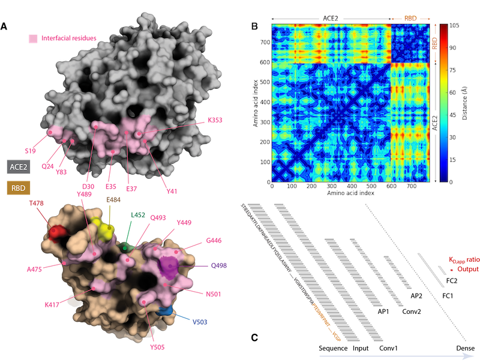
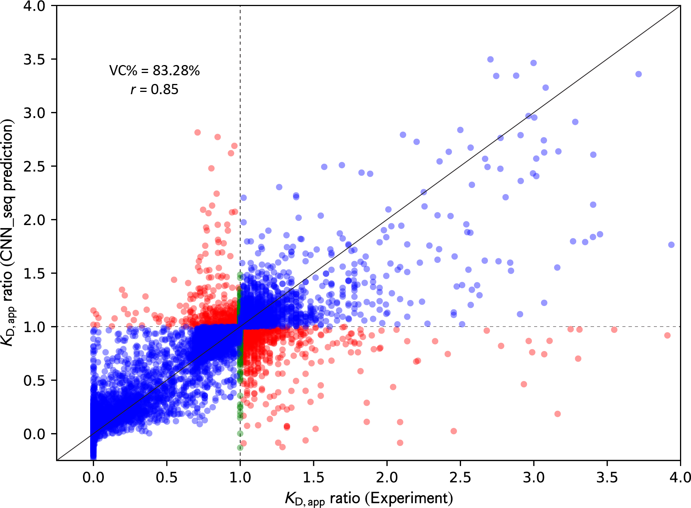
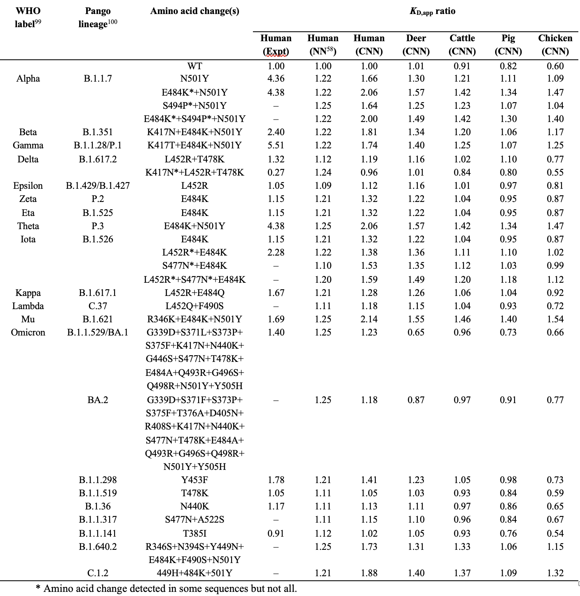
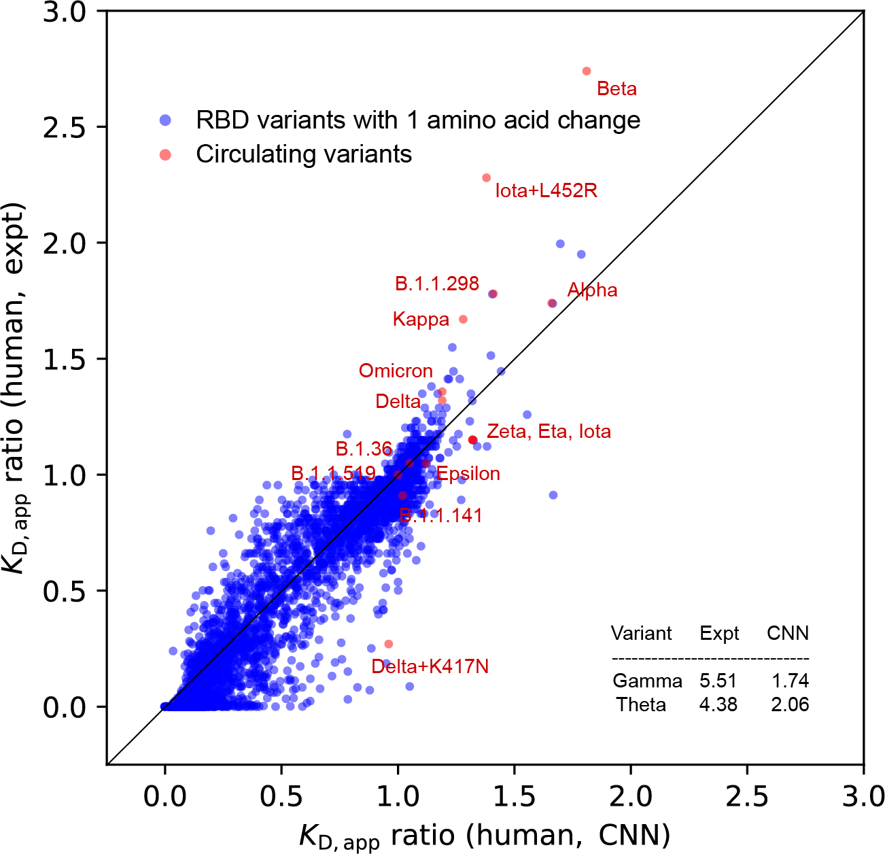
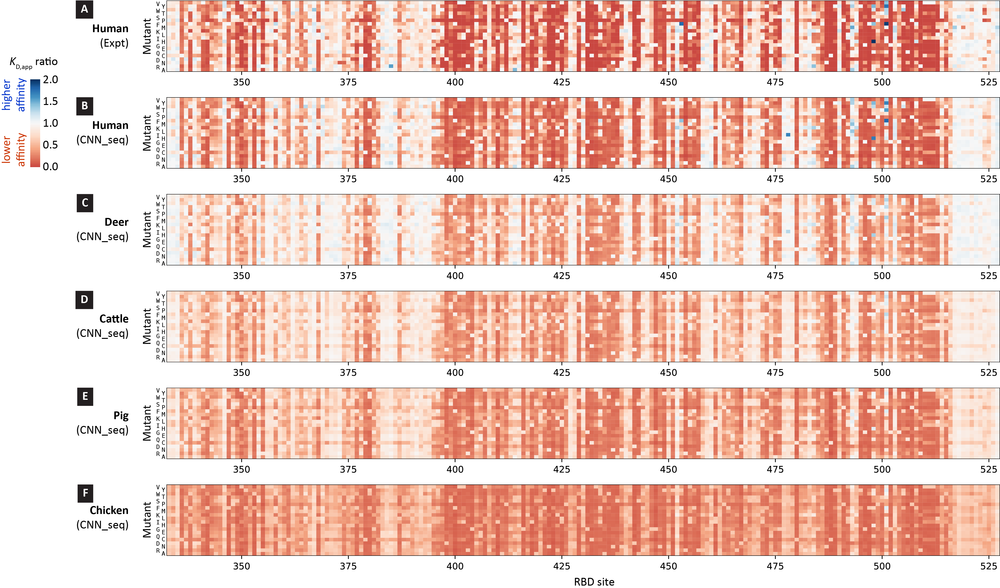

# SARS-CoV-2 variant binding affinity prediction

**Author:** `Chen Chen` 
**Date:** `2023-05-03` 
**Tags:** `Python`, `Machine Learning`, `Statistics`, `Bioinformatics` 

## Introduction

The cellular entry of severe acute respiratory syndrome coronavirus 2 (SARS-CoV-2) involves the association of its receptor binding domain (RBD) with human angiotensin-converting enzyme 2 (hACE2) as the first crucial step. The binding affinity between RBD and ACE2 proteins contributes to infectivity and transmissibility, and amino acid (AA) changes or mutations on either protein can alter the resulting variant's binding affinity to different degrees. To predict the binding affinity of these variants, a machine-learning (ML) model was developed based on the experiment data available and applied to both human and livestock cases.

Specifically, the following tasks are covered in the present project:

- Data preparation section describes the collection of experimental data, protein sequence data, homology modeling, and the calculation of AA distance maps.
- Model development section summarizes the feature encoding, model training, and validation.
- Results section briefly discusses the predictions from the present model and their implications.

Note that this is a truncated version of the study, to get more technical details, please refer to the original publication [A CNN model for predicting binding affinity changes between SARS-CoV-2 spike RBD variants and ACE2 homologues](https://www.biorxiv.org/content/10.1101/2022.03.22.485413v1).

Before delving into the details, a few concepts are introduced here to help the reader understand the story better:

- **Wild type (WT):** The original version of the SARS-CoV-2 virus.
- **Variant:** The SARS-CoV-2 virus that has one or more AA changes (on the RBD) than the WT.
- **(KD,app) ratios:** The apparent dissociation constant ratio between the variants and the WT. KD,app > 1 indicates the variant has stronger binding than WT, and KD,app < 1 suggests a weaker binding, and KD,app = 1 means there is no binding strength difference.
- **Amino acid:** Amino acids are organic compounds that contain both amino and carboxylic acid functional groups.[1] Although over 500 amino acids exist in nature, by far the most important are the alpha-amino acids, from which proteins are composed. *-- Wikipedia*
- **Residue:** In biochemistry and molecular biology, a residue refers to a specific monomer within the polymeric chain of a polysaccharide, protein or nucleic acid. *-- Wikipedia*
- **Homology modeling:** Also known as comparative modeling of protein, refers to constructing an atomic-resolution model of the "target" protein from its amino acid sequence and an experimental three-dimensional structure of a related homologous protein (the "template"). *-- Wikipedia*

## Data preparation
Generally, the following categories of data are prepared for different purposes:

- Experimental data were obtained from the paper [Deep Mutational Scanning of SARS-CoV-2 Receptor Binding Domain Reveals Constraints on Folding and ACE2 Binding](https://www.sciencedirect.com/science/article/pii/S0092867420310035), and [Engineering human ACE2 to optimize binding to the spike protein of SARS coronavirus 2](https://www.science.org/doi/10.1126/science.abc0870) where (KD,app) ratios between the variants and the WT is reported for SARS-CoV-2 variants with single and multiple AA changes through mutational scanning.
- The Homology modelings were performed using SWISS-Model, from where the sequence data of proteins are also obtained.
- The protein contact map can be generated by utilizing the Protein Contact Maps tool developed by [Benjamin et al](https://nanohub.org/resources/9924/usage). 
- Identification of protein-protein interfacial contacts using PDBePISA. This information is used in CNN feature encoding process to label whether a specific residue is at the interface or involved in hydrogen bonds and salt bridges, such that the weight of the feature could be adjusted independently. 

	 
	<b>Figure 1. </b>
		Comparison of KD,app ratio between experiments and CNN_seq models predictions from five-fold cross-validation tests on 8,440 variants. Correctly classified variants are colored in blue, incorrectly classified variants are colored in red, and variants with unchanged binding affinities are colored in green. Horizontal and vertical dashed lines are drawn to indicate the dividing line where KD,app ratio equals 1, and a diagonal solid line is drawn to indicate perfect correlation.
	

As illustrated above, upon acquiring all these data, the interfacial residues can be identified (Figure 1A), the residue-residue distances can be determined (Figure 1B), all of which will be fed into the convolutional neural network (CNN) model (Figure 1C) to be built.

## Model development

### Feature encoding

The CNN_seq model uses both sequence-based and structure-based features in model construction to maximize the utilization of available data. For the human case, the sequences and three-dimensional (3D) structure of SARS-CoV-2 spike RBD in complex with hACE2 were obtained from the Protein Data Bank (PDB ID: 6LZG), for the animal cases, the sequences of ACE2 proteins were collected from UniProt for four species: deer (Odocoileus virginianus, ID: A0A6J0Z472), cattle (Bos indicus × Bos taurus, ID: A0A4W2H6E0), pig (Sus scrofa, ID: A0A220QT48), and chicken (Gallus gallus, ID: F1NHR4).  Due to the lack of experimentally determined structures for these animals, we used SWISS-Model to perform homology modeling and generated 3D structures for the complexes. Subsequent structural refinement for each complex was performed through an MD simulation with explicit water.

### Model training and validation
For model evaluation, we followed the five-fold cross-validation procedure, where the entire dataset was split into five subsets, with each subset considered as the test set once, and the rest of the four subsets are used together to form the training set. A complete cycle of five-fold cross-validation produced five individual models, and each model made predictions on the subset of variants that the model itself did not see. Combining predictions of the five subsets, all the variants in the original dataset were predicted once, and the performance of the model can be fairly evaluated. Two metrics were used to evaluate the performance of the CNN_seq model, the percent recovery of correct variant classification (%VC) and the Pearson correlation coefficient (r). The %VC calculates in percentage the accuracy of classifying the direction of change in the binding affinity compared to WT, while r measures the strength of the linear correlation between the predicted and experimental KD,app ratio values. 

	 
	<b>Figure 1. </b>
		Comparison of KD,app ratio between experiments and CNN_seq models predictions from five-fold cross-validation tests on 8,440 variants. Correctly classified variants are colored in blue, incorrectly classified variants are colored in red, and variants with unchanged binding affinities are colored in green. Horizontal and vertical dashed lines are drawn to indicate the dividing line where KD,app ratio equals 1, and a diagonal solid line is drawn to indicate perfect correlation.
	

The averaged results from the five-fold cross-validation tests of the model achieved a %VC of 83.28% and a correlation coefficient r of 0.85 for a complete dataset of 8,440 variants, indicating the robustness of the achieved model.

## Results for human
For experimentally tested variants with multiple amino acid changes we used the reported KD,app ratio to make comparisons. Given the often-large differences in the reported values, the median calculated from the available experiment results was used. 

	<b>Table 1. </b>
		Comparison of KD,app ratio from experiments (Expt), CNN_seq (CNN), and NN_MM-GBSA (NN) model predictions on circulating RBD variants complexed with human and animal ACE2 proteins.
	 
	

Table 1 summarizes the prediction of the present CNN\_seq model on the circulating variants. For this small blinded test set, the CNN_seq model achieved a %VC of 92.9% and r of 0.60.

	 
	<b>Figure 3. </b>
		Comparison of KD,app ratio between experiments and CNN_seq models predictions from scanning on 3900 variants with one amino acid change. Scanning results are colored in blue, and circulating variants are labeled in red or indicated in the inset table. A diagonal dashed line is drawn to indicate the perfect positive correlation. 
	

Figure 3 compares the CNN_seq predicted and experimental KD,app ratio values for variants formed by hACE2 and RBD with single amino acid changes. In total, 195 × 20 = 3,900 RBD variants were scanned, where 3,883 of them have experimental referenced data. We also placed the circulating variants on top of the plot showing the binding affinity improvement strategy of them.

## Results for animals
To illustrate the variant distribution across the RBD sites under investigation, in Figure 4 we constructed the binding affinity change heatmaps for all 3,900 variants with one amino acid changes followed the pictorial style introduced in Starr et al.30 Each one of the stripes represents the complete scanning results for one of the species, where the horizontal and vertical axes indicate the RBD sites and amino acid, respectively. The small squares are colored according to the CNN\_seq predicted KD,app ratio values, with red for lower affinity, blue for higher affinity, and white for neutral or similar affinity. The general patterns of the heatmap for the experimental data (Figure 4A) are well captured in the CNN_seq predictions (Figure 4B) for the human case, in line with the VC% and r values obtained from data shown in Figure 3A.

	 
	<b>Figure 4. </b>
		Binding affinity change heatmaps of RBD variants for ACE2 proteins from human and animal hosts. Experimental values and CNN_seq predictions for human are shown in (A) and (B), and CNN_seq predictions for animals are depicted in (C) deer, (D) cattle, (E) pig, (F) chicken. Squares are colored according to the KD,app ratio values. 
	

Apparently, the binding affinity of RBD variants against animal ACE2s follows similar trends as those against human ACE2. White-tailed deer ACE2 binds to RBD almost as tightly as human ACE2 while cattle, pig, and chicken ACE2s bind weakly. The model allows testing whether adaptation of the virus for increased binding with other animals would cause concomitant increases in binding with hACE2 or decreased fitness due to adaptation to other hosts. 

## Conclusion
This project briefly describes the procedures for building a CNN_seq model that can reasonably predict the effect of mutations on the binding affinity of SARS-CoV-2 for its receptor proteins. This model can be efficiently trained over a relatively large number of data, which allows readily continuous improvement when new experimental data from different sources are available.
