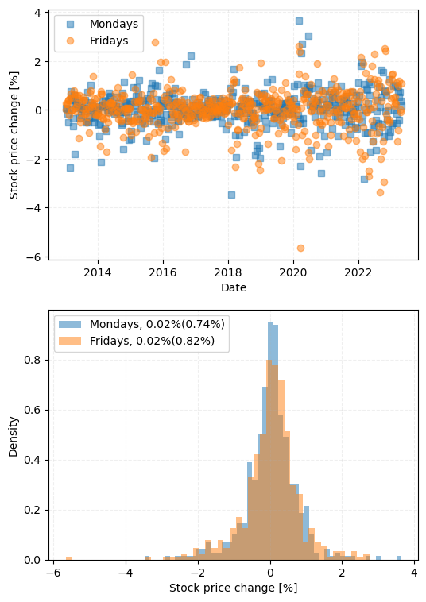

# Stock price analysis

**Author:** `Chen Chen`
**Date:** `2023-05-02`

**Tags:** `Python`, `Statistics`, `SQL`

## Introduction
Stock price prediction has always been a hot topic and understanding the fluctuation behavior is the key. In the present project, the following tasks are completed:

- A local MySQL database Was constructed by pulling data from Yahoo Finance 
- Some basic analyses were performed to check if some of the intuitions about the stocks are correct.
- The Markov Chain model was built to understand some basic fluctuation patterns

## Data preparation
Retrieving online stock data can be easily achieved by using Google Sheets or Excel to pull data from Google Finance or Yahoo Finance. This is convenient until a large amount of data is needed to do some more complex analyses. Querying a local database considerably simplifies the process of data preparation and accelerates the analysis.

The MySQL database is constructed following the article [Securities Master Database with MySQL and Python](https://www.quantstart.com/articles/Securities-Master-Database-with-MySQL-and-Python/). A list of S&P500 companies together with a few index and sector exchange-traded funds (ETFs) was monitored and the time period spans from 2013 to 2023.
## Exploratory analysis

### Stock price changes on different weekdays
A while ago, some friends mentioned to me that there seems to be a trend that the stock prices usually increase on Fridays and decline on Mondays, and others might have the opposite impression of that. The difference between the close_price and the open_price of some ETFs such as `SPY` can be used to check if this trend exists.

However, from the results shown above, it is apparent that there are no consistent patterns for the price change on Mondays and Fridays, showing a similar mean price change of 0.02%. 

	

By plotting statistics of all five days on the above box plot and comparing all the data to the zero-percent-change horizontal baseline (blue dashed line), it is clear that for `SPY`, there is no specific price change pattern on any weekday. Note that, this might not be universal and represents only a general market behavior.

### Markov chain model (MCM)
*"A Markov chain or Markov process is a stochastic model describing a sequence of possible events in which the probability of each event depends only on the state attained in the previous event." -- Wikipedia*

The implementation of MCM to the stock prices is inspired by the tutorial [Predict Stock-Market Behavior with Markov Chains and Python](https://www.viralml.com/static/code/Predict-Stock-Market-With-Markov-Chains-and-Python.html). Essentially, the objective of the analysis is to predict the price change depending on the historical patterns. For example, if a stock's price has been going up for three days by 2%, how likely it will increase on the fourth day? Apparently, a definite and confident answer probably does not exist but knowing how much this method can do can still be beneficial.

## Conclusion
In this project, we've built a local MySQL database and retrieved data from Yahoo Finance for 500+ stocks. The simple analyses performed on `SPY` revealed that there doesn't seem to be any general price change pattern on different weekdays. The Markov chain model was built to further check the stock price fluctuation styles, which can be applied to screen other stock candidates to identify the hidden patterns. 
